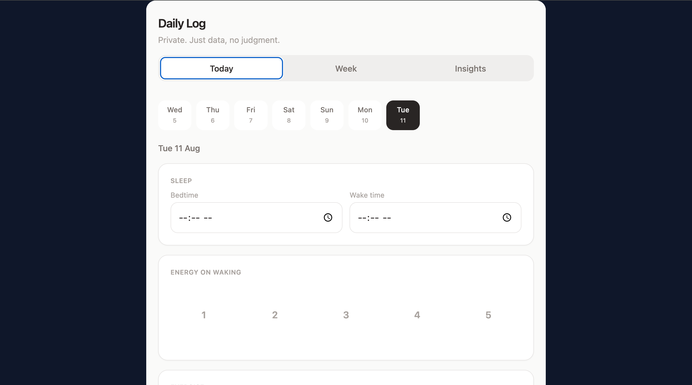

# Habit Tracker

A React + Vite habit tracking app with local storage persistence and daily insights.

## Features

- Daily habit logging with sleep, energy, exercise, mood, and notes
- Week view with recent activity and quick day selection
- Insights dashboard for comparisons and streak tracking
- Local storage persistence for private data
- Tailwind CSS styling with Vite + TypeScript

## Project structure

- `index.html` — app entry HTML
- `src/main.tsx` — React app bootstrap
- `src/App.tsx` — app shell
- `src/Tracker.tsx` — main tracker UI and logic
- `src/index.css` — global styles and Tailwind directives
- `postcss.config.js` — PostCSS config
- `tailwind.config.js` — Tailwind config
- `.github/workflows/deploy.yml` — GitHub Pages deployment workflow

## Setup

Install dependencies:

```bash
npm install
```

Start the development server:

```bash
npm run dev
```

Build for production:

```bash
npm run build
```

Preview the production build:

```bash
npm run preview
```

## Deployment

This repo includes a GitHub Actions workflow at `.github/workflows/deploy.yml` that builds the app and publishes the `dist/` directory to GitHub Pages when you push to `main`.

### Enable GitHub Pages

1. Push the repository to GitHub.
2. In the repo settings, enable GitHub Pages.
3. Choose the `gh-pages` branch or use the default GitHub Pages action output.

## Screenshot




## Notes

- The app uses local storage for persistence, so data is stored in the browser and stays private.
- If you want to switch from local storage to a backend later, the storage helper in `src/Tracker.tsx` can be replaced easily.
